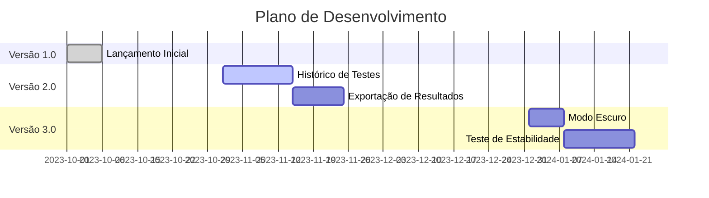

# 🚀 FesttestWeb - Teste de Velocidade Inteligente

<div align="center">
  
  <p>✨ Interface moderna e intuitiva para análise de conexão</p>
</div>

## 🌟 Recursos Destacados

| 🔍 Diagnóstico Completo | 🎯 Precisão | 🖥 Multiplataforma |
|-----------------------|------------|------------------|
| Teste download, upload, ping e jitter | Algoritmos otimizados | Funciona em qualquer navegador |
| 🏆 **Servidores Brasileiros** | 📊 **Gráficos Interativos** | 🔄 **Teste Rápido** |
| Claro, Vivo, TIM e outros | Visualização intuitiva dos dados | Resultados em menos de 30s |

## 🛠 Tecnologias Utilizadas

<div align="center">
  
| **Frontend** | **Backend** | **Bibliotecas** |
|--------------|-------------|-----------------|
|  |  |  |
|  |  |  |
|  |  |  |

</div>

## ⚡ Como Usar

```bash
# 1. Clone o repositório
git clone https://github.com/seu-usuario/festtestweb.git

# 2. Acesse a pasta do projeto
cd festtestweb

# 3. Instale as dependências
pip install -r requirements.txt

# 4. Execute o aplicativo
python app.py
```

🌐 Acesse no navegador: [http://localhost:5000](http://localhost:5000)

## 📊 Métricas Analisadas

<div align="center">

| Métrica | Ícone | Descrição | Valor Ideal |
|---------|-------|-----------|-------------|
| **Download** | ⬇️ | Velocidade de recebimento | >50 Mbps |
| **Upload** | ⬆️ | Velocidade de envio | >20 Mbps |
| **Ping** | 🏓 | Tempo de resposta | <30 ms |
| **Jitter** | 📶 | Variação de latência | <5 ms |
| **CPING** | 🔍 | Ping para Google | <20 ms |

</div>

## 🎨 Design Moderno

```css
:root {
  --primary: #48eb91;     /* Verde vibrante */
  --secondary: #10b981;   /* Verde mais suave */
  --dark: #1e293b;        /* Azul escuro */
  --light: #f8fafc;       /* Branco suave */
}
```

Princípios de design:
- ✅ Minimalista e limpo
- ✅ Foco na usabilidade
- ✅ Animações suaves
- ✅ Totalmente responsivo

## 🌐 Servidores Suportados

- **Grandes Operadoras**: Claro, Vivo, TIM, Oi
- **Provedores Regionais**: Algar Telecom, Sercomtel
- **Internacionais**: Servidores automáticos globais

## 📌 Roadmap



## 🤝 Como Contribuir

1. Faça um fork do projeto
2. Crie uma branch (`git checkout -b feature/nova-feature`)
3. Commit suas mudanças (`git commit -m 'Adiciona nova feature'`)
4. Push para a branch (`git push origin feature/nova-feature`)
5. Abra um Pull Request

## 📝 Licença

Este projeto está licenciado sob a licença MIT - veja o arquivo [LICENSE](LICENSE) para detalhes.

---

<div align="center">
  <p>Desenvolvido com ❤️ por <strong>Luiz Felipe</strong></p>
  <p>📧 contato@exemplo.com | 🌐 https://seusite.com</p>
</div>
